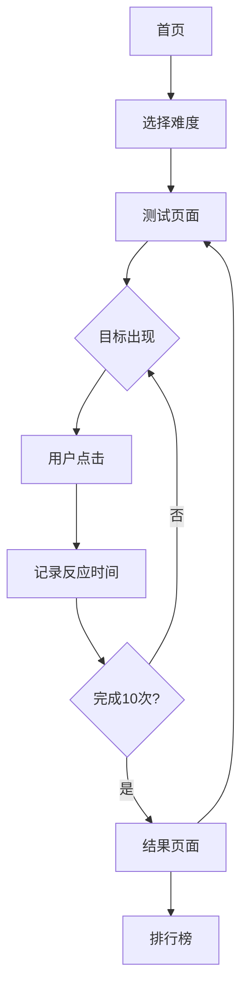

## 1. 产品概述
瓦罗兰特反应速度测试游戏是一款专为电竞选手设计的训练工具，通过模拟FPS游戏中的目标出现机制来测试和提升玩家的反应速度。
- 解决电竞选手缺乏专业反应训练工具的问题，提供标准化的反应速度评估
- 帮助玩家了解自己的反应能力水平，针对性提升竞技表现

## 2. 核心功能

### 2.1 用户角色
| 角色 | 注册方式 | 核心权限 |
|------|----------|----------|
| 普通用户 | 无需注册 | 进行反应测试、查看单次成绩 |
| 注册用户 | 邮箱注册 | 保存历史记录、查看排行榜、个人数据分析 |

### 2.2 功能模块
本产品包含以下主要页面：
1. **首页**: 游戏开始入口、难度选择、个人记录展示
2. **测试页面**: 目标出现区域、计时器、命中反馈
3. **结果页面**: 反应时间显示、准确率统计、等级评定
4. **排行榜页面**: 全球排名、好友排名、个人最佳记录

### 2.3 页面详情
| 页面名称 | 模块名称 | 功能描述 |
|----------|----------|----------|
| 首页 | 开始游戏按钮 | 点击进入测试模式选择界面 |
| 首页 | 难度选择 | 提供简单/普通/困难三种难度，影响目标大小和出现频率 |
| 首页 | 个人记录 | 显示历史最佳反应时间和平均准确率 |
| 测试页面 | 游戏区域 | 全屏黑色背景，随机位置出现圆形目标 |
| 测试页面 | 目标生成 | 随机间隔时间(1-3秒)后出现红色目标，持续0.5-1.5秒 |
| 测试页面 | 命中检测 | 点击目标后立即消失，记录反应时间 |
| 测试页面 | 进度显示 | 显示当前测试进度(总目标数/已完成数) |
| 结果页面 | 成绩展示 | 显示平均反应时间(ms)、命中率(%)、等级评定 |
| 结果页面 | 详细数据 | 显示最快/最慢反应时间、命中次数/总次数 |
| 结果页面 | 重新开始 | 按钮重新进入测试，保存当前成绩 |
| 排行榜页面 | 全球榜单 | 显示前100名玩家成绩，包含昵称、反应时间、日期 |
| 排行榜页面 | 个人排名 | 显示当前用户在全球和好友中的排名位置 |

## 3. 核心流程
用户操作流程：
1. 用户进入首页，选择游戏难度
2. 点击开始游戏，进入测试页面
3. 系统开始计时，随机位置出现红色目标
4. 用户点击目标，系统记录反应时间
5. 重复步骤3-4，共进行10次测试
6. 测试结束，显示成绩和详细数据
7. 可选择查看排行榜或重新开始

## 4. 用户界面设计

### 4.1 设计风格
- **主色调**: 黑色背景(#000000) + 红色目标(#FF0000) + 白色文字(#FFFFFF)
- **按钮样式**: 圆角矩形，悬停时有红色发光效果
- **字体**: 无衬线字体，主要文字18px，标题36px
- **布局风格**: 全屏沉浸式，顶部状态栏显示必要信息
- **图标风格**: 简约线条风格，符合电竞游戏审美

### 4.2 页面设计概览
| 页面名称 | 模块名称 | UI元素 |
|----------|----------|--------|
| 首页 | 主标题 | 大字体"瓦罗兰特反应测试"，红色渐变效果 |
| 首页 | 开始按钮 | 居中红色按钮，悬停时放大1.1倍 |
| 首页 | 难度选择 | 三个并排卡片，显示难度名称和描述 |
| 测试页面 | 游戏区域 | 纯黑背景，鼠标指针变为十字准星 |
| 测试页面 | 目标 | 红色圆形，直径根据难度变化(30px/20px/15px) |
| 测试页面 | 状态栏 | 顶部显示当前进度和剩余时间 |
| 结果页面 | 成绩卡片 | 半透明黑色背景，突出显示平均反应时间 |
| 结果页面 | 数据图表 | 柱状图显示各次反应时间分布 |
| 排行榜页面 | 榜单表格 | 交替行背景色，前三名特殊标识 |

### 4.3 响应式设计
- 桌面端优先设计，支持1920x1080及以上分辨率
- 移动端适配：目标大小自动调整，触摸区域优化
- 横屏模式支持，确保游戏区域充分利用屏幕空间

### 4.4 游戏场景指导
- **环境氛围**: 暗色调电竞风格，营造专注的测试环境
- **视觉效果**: 目标出现时带有轻微发光效果，增强视觉冲击力
- **音效反馈**: 击中目标时的清脆音效，增强操作反馈
- **动画效果**: 目标淡入淡出，界面切换平滑过渡