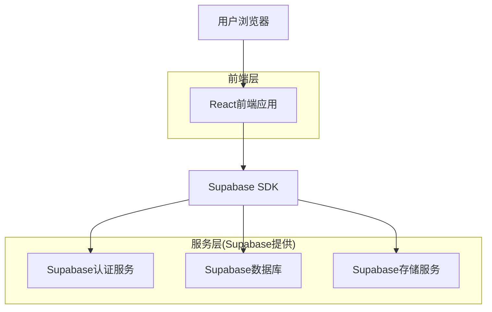
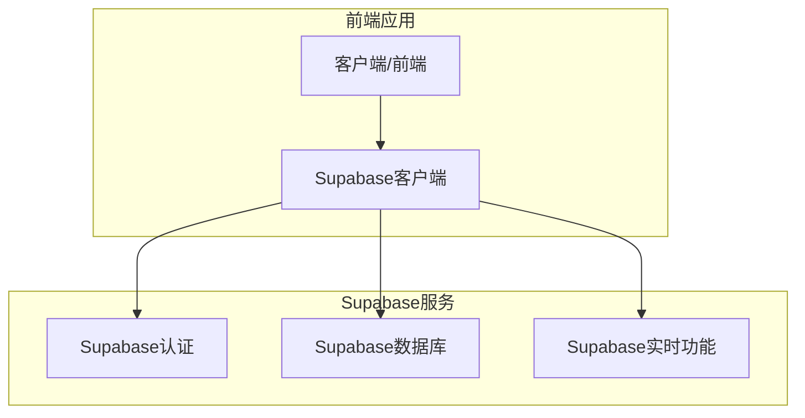
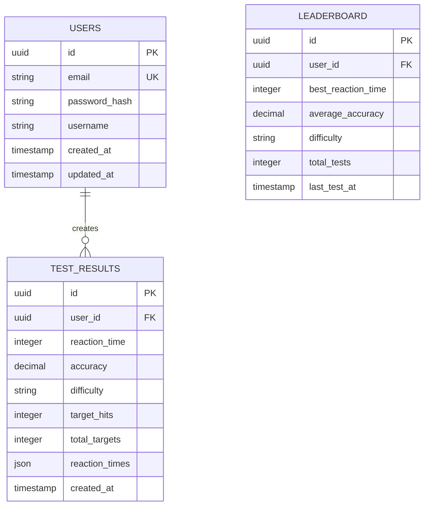

## 1. 架构设计



## 2. 技术描述

- **前端**: React@18 + TypeScript + Tailwind CSS@3 + Vite
- **初始化工具**: vite-init
- **后端**: Supabase (提供认证、数据库、存储服务)
- **状态管理**: React Context + useReducer
- **动画库**: Framer Motion
- **图表库**: Chart.js + react-chartjs-2

## 3. 路由定义

| 路由 | 用途 |
|-------|---------|
| / | 首页，游戏入口和难度选择 |
| /game | 测试页面，进行反应速度测试 |
| /result | 结果页面，显示测试成绩 |
| /leaderboard | 排行榜页面，显示全球排名 |
| /profile | 个人资料页面，查看历史记录 |
| /login | 登录页面，用户认证 |
| /register | 注册页面，新用户注册 |

## 4. API定义

### 4.1 核心API

#### 用户认证相关
```
POST /api/auth/login
```

请求:
| 参数名| 参数类型 | 是否必需 | 描述 |
|-----------|-------------|-------------|-------------|
| email | string | true | 用户邮箱 |
| password | string | true | 密码 |

响应:
| 参数名| 参数类型 | 描述 |
|-----------|-------------|-------------|
| user | object | 用户信息 |
| session | object | 会话token |

#### 测试结果记录
```
POST /api/test-results
```

请求:
| 参数名| 参数类型 | 是否必需 | 描述 |
|-----------|-------------|-------------|-------------|
| user_id | string | true | 用户ID |
| reaction_time | number | true | 平均反应时间(ms) |
| accuracy | number | true | 准确率(%) |
| difficulty | string | true | 难度级别 |
| target_hits | number | true | 命中次数 |
| total_targets | number | true | 目标总数 |

#### 获取排行榜
```
GET /api/leaderboard?difficulty={difficulty}&limit={limit}
```

响应:
| 参数名| 参数类型 | 描述 |
|-----------|-------------|-------------|
| rankings | array | 排行榜数据 |
| user_rank | number | 当前用户排名 |

## 5. 服务器架构图



## 6. 数据模型

### 6.1 数据模型定义



### 6.2 数据定义语言

用户表 (users)
```sql
-- 创建表
CREATE TABLE users (
    id UUID PRIMARY KEY DEFAULT gen_random_uuid(),
    email VARCHAR(255) UNIQUE NOT NULL,
    password_hash VARCHAR(255) NOT NULL,
    username VARCHAR(50) UNIQUE NOT NULL,
    created_at TIMESTAMP WITH TIME ZONE DEFAULT NOW(),
    updated_at TIMESTAMP WITH TIME ZONE DEFAULT NOW()
);

-- 创建索引
CREATE INDEX idx_users_email ON users(email);
CREATE INDEX idx_users_username ON users(username);
```

测试结果表 (test_results)
```sql
-- 创建表
CREATE TABLE test_results (
    id UUID PRIMARY KEY DEFAULT gen_random_uuid(),
    user_id UUID REFERENCES users(id) ON DELETE CASCADE,
    reaction_time INTEGER NOT NULL, -- 平均反应时间(毫秒)
    accuracy DECIMAL(5,2) NOT NULL, -- 准确率(百分比)
    difficulty VARCHAR(20) NOT NULL CHECK (difficulty IN ('easy', 'normal', 'hard')),
    target_hits INTEGER NOT NULL,
    total_targets INTEGER NOT NULL,
    reaction_times JSONB, -- 存储每次反应时间的详细数据
    created_at TIMESTAMP WITH TIME ZONE DEFAULT NOW()
);

-- 创建索引
CREATE INDEX idx_test_results_user_id ON test_results(user_id);
CREATE INDEX idx_test_results_created_at ON test_results(created_at DESC);
CREATE INDEX idx_test_results_difficulty ON test_results(difficulty);
```

排行榜表 (leaderboard)
```sql
-- 创建表
CREATE TABLE leaderboard (
    id UUID PRIMARY KEY DEFAULT gen_random_uuid(),
    user_id UUID REFERENCES users(id) ON DELETE CASCADE,
    best_reaction_time INTEGER NOT NULL,
    average_accuracy DECIMAL(5,2) NOT NULL,
    difficulty VARCHAR(20) NOT NULL CHECK (difficulty IN ('easy', 'normal', 'hard')),
    total_tests INTEGER DEFAULT 0,
    last_test_at TIMESTAMP WITH TIME ZONE DEFAULT NOW(),
    created_at TIMESTAMP WITH TIME ZONE DEFAULT NOW(),
    updated_at TIMESTAMP WITH TIME ZONE DEFAULT NOW()
);

-- 创建索引
CREATE INDEX idx_leaderboard_difficulty_time ON leaderboard(difficulty, best_reaction_time);
CREATE INDEX idx_leaderboard_user_id ON leaderboard(user_id);
```

### 6.3 Supabase访问权限设置

```sql
-- 基本权限设置
GRANT SELECT ON users TO anon;
GRANT ALL PRIVILEGES ON users TO authenticated;

GRANT SELECT ON test_results TO anon;
GRANT ALL PRIVILEGES ON test_results TO authenticated;

GRANT SELECT ON leaderboard TO anon;
GRANT ALL PRIVILEGES ON leaderboard TO authenticated;

-- RLS策略(行级安全)
ALTER TABLE test_results ENABLE ROW LEVEL SECURITY;
ALTER TABLE leaderboard ENABLE ROW LEVEL SECURITY;

-- 测试结果的RLS策略
CREATE POLICY "用户只能查看自己的测试结果" ON test_results
    FOR SELECT USING (auth.uid() = user_id);

CREATE POLICY "用户可以插入自己的测试结果" ON test_results
    FOR INSERT WITH CHECK (auth.uid() = user_id);

-- 排行榜的RLS策略
CREATE POLICY "所有人都可以查看排行榜" ON leaderboard
    FOR SELECT USING (true);

CREATE POLICY "用户只能更新自己的排行榜数据" ON leaderboard
    FOR UPDATE USING (auth.uid() = user_id);
```